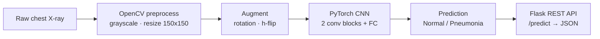

# Pneumonia Detection from Chest X-Rays

> A custom PyTorch CNN that classifies chest X-ray images as **Normal** or **Pneumonia**, served through a containerized Flask REST API with a lightweight web UI.


An end-to-end deep-learning project that trains a convolutional neural network on chest X-ray images to detect pneumonia, then exposes the trained model as a REST API for real-time inference. It covers the full workflow: image preprocessing with OpenCV, data augmentation, model training and evaluation in PyTorch, and deployment behind a Flask endpoint that returns a prediction for an uploaded X-ray.

---

## ⚠️ Medical Disclaimer

This project is for **educational and research purposes only**. It is **not** a medical device and is **not** intended for clinical use, diagnosis, or treatment decisions. The model is trained on a limited public dataset of pediatric chest X-rays and has not been clinically validated. Always consult a qualified healthcare professional for any medical concern.

---

## Table of Contents
- [Overview](#overview)
- [Dataset](#dataset)
- [Pipeline](#pipeline)
- [Model Architecture](#model-architecture)
- [Results](#results)
- [Quickstart](#quickstart)
- [Run with Docker](#run-with-docker)
- [API Reference](#api-reference)
- [Project Structure](#project-structure)
- [Tech Stack](#tech-stack)
- [License](#license)
- [Acknowledgements](#acknowledgements)

---

## Overview

Pneumonia is diagnosed in part by reading chest radiographs, a task that benefits from fast, consistent screening tools. This project builds a binary image classifier (Normal vs. Pneumonia) from scratch in PyTorch and wraps it in a small Flask service so a user can upload an X-ray and get an instant prediction. The goal is to demonstrate the complete lifecycle of a computer-vision model — preprocessing, augmentation, training, evaluation, and serving — rather than to produce a clinical-grade system.

**Highlights**
- Custom CNN built with PyTorch (no pretrained backbone).
- OpenCV-based grayscale preprocessing and resizing.
- Data augmentation (random rotation, horizontal flip) to reduce overfitting.
- Flask REST API with a browser upload UI for real-time predictions.
- Reproducible, pinned dependencies and a ready-to-build Dockerfile.

---

## Dataset

This project uses the public **[Chest X-Ray Images (Pneumonia)](https://www.kaggle.com/datasets/paultimothymooney/chest-xray-pneumonia)** dataset (Kermany et al., via Kaggle / Paul Mooney).

| Property | Detail |
|---|---|
| Total images | 5,863 JPEG chest X-rays |
| Classes | `NORMAL`, `PNEUMONIA` |
| Official splits | 5,216 train · 624 test · 16 val |
| Source | Pediatric patients (1–5 yrs), Guangzhou Women and Children's Medical Center |

The training code (`preprocess.py`) reads the `chest_xray/train` and `chest_xray/test` folders. The dataset is **not** committed to this repository — download it from Kaggle and unzip it into the project root:

```
chest_xray/
├── train/
│   ├── NORMAL/
│   └── PNEUMONIA/
└── test/
    ├── NORMAL/
    └── PNEUMONIA/
```

---

## Pipeline



---

## Model Architecture

A compact **custom CNN** (`model.py`) trained from scratch — no transfer learning. It takes a single-channel (grayscale) 150×150 image and outputs two class logits.

| Stage | Layer | Output |
|---|---|---|
| Input | Grayscale image | 1 × 150 × 150 |
| Block 1 | Conv2d(1→32, 3×3, pad 1) → ReLU → MaxPool(2) | 32 × 75 × 75 |
| Block 2 | Conv2d(32→64, 3×3, pad 1) → ReLU → MaxPool(2) | 64 × 37 × 37 |
| Head | Flatten → Linear(87,616→128) → ReLU → Linear(128→2) | 2 logits |

**Training configuration** (`train.py`)
- Optimizer: Adam, learning rate `1e-3`
- Loss: `CrossEntropyLoss`
- Epochs: 10 (fixed loop)
- Batch size: 32
- Device: CUDA if available, otherwise CPU
- Checkpoint: weights saved to `pneumonia_cnn.pth`

---

## Results

`evaluate.py` computes **top-1 classification accuracy** on the held-out test split.

| Metric | Value |
|---|---|
| Test accuracy | ~92% *(as reported by the author)* |

> **Note on metrics:** The evaluation code reports **accuracy** — it does not currently compute AUC, precision, recall, or a confusion matrix. The exact accuracy depends on your trained checkpoint (the `.pth` file is not committed), so re-run `train.py` and `evaluate.py` to reproduce the figure on your hardware. Adding AUC / precision / recall and a confusion matrix is a natural next step.

---

## Quickstart

**Prerequisites:** Python 3.8+ and the dataset downloaded into `chest_xray/` (see [Dataset](#dataset)).

```bash
# 1. Clone
git clone https://github.com/Asrar-ali/Pneumonia-Detection.git
cd Pneumonia-Detection

# 2. Install dependencies (a virtualenv is recommended)
pip install -r requirements.txt

# 3. Train the model (writes pneumonia_cnn.pth)
python train.py

# 4. Evaluate test accuracy
python evaluate.py

# 5. Serve the API + web UI
python app.py
# open http://localhost:5000 and upload a chest X-ray
```

---

## Run with Docker

A `Dockerfile` is included so the API can run in a container (served with Gunicorn). Train the model first so that `pneumonia_cnn.pth` exists in the project directory, then:

```bash
# Build the image
docker build -t pneumonia-detection .

# Run, mounting the trained weights into the container
docker run -p 5000:5000 -v "$(pwd)/pneumonia_cnn.pth:/app/pneumonia_cnn.pth" pneumonia-detection
```

The service is then available at `http://localhost:5000`.

---

## API Reference

`app.py` exposes two routes:

| Method | Endpoint | Description |
|---|---|---|
| `GET` | `/` | Renders the upload UI (`templates/index.html`). |
| `POST` | `/predict` | Accepts a multipart `file` (an X-ray image) and returns a JSON prediction. |

**Example**

```bash
curl -X POST -F "file=@sample_xray.jpeg" http://localhost:5000/predict
```

```json
{ "result": "Pneumonia Detected" }
```

The model returns `"Pneumonia Detected"` (class 1) or `"Normal"` (class 0).

---

## Project Structure

```
Pneumonia-Detection/
├── model.py            # Custom CNN definition (PneumoniaCNN)
├── preprocess.py       # Dataset class, OpenCV preprocessing, augmentation, dataloaders
├── train.py            # Training loop + per-epoch validation; saves pneumonia_cnn.pth
├── evaluate.py         # Loads checkpoint and reports test accuracy
├── app.py              # Flask REST API for real-time inference
├── templates/
│   └── index.html      # Upload UI
├── requirements.txt    # Pinned dependencies
├── Dockerfile          # Container image for the API
└── LICENSE             # MIT
```

---

## Tech Stack

**Language:** Python
**Deep learning:** PyTorch, TorchVision
**Computer vision:** OpenCV, Pillow
**Web / serving:** Flask, Gunicorn, Docker
**Utilities:** NumPy, Matplotlib

---

## License

Distributed under the **MIT License**. See [LICENSE](LICENSE) for details.

---

## Acknowledgements

- **Dataset:** [Chest X-Ray Images (Pneumonia)](https://www.kaggle.com/datasets/paultimothymooney/chest-xray-pneumonia) — Kermany, Zhang & Goldbaum, hosted on Kaggle by Paul Mooney.
- Built with PyTorch, OpenCV, and Flask.
